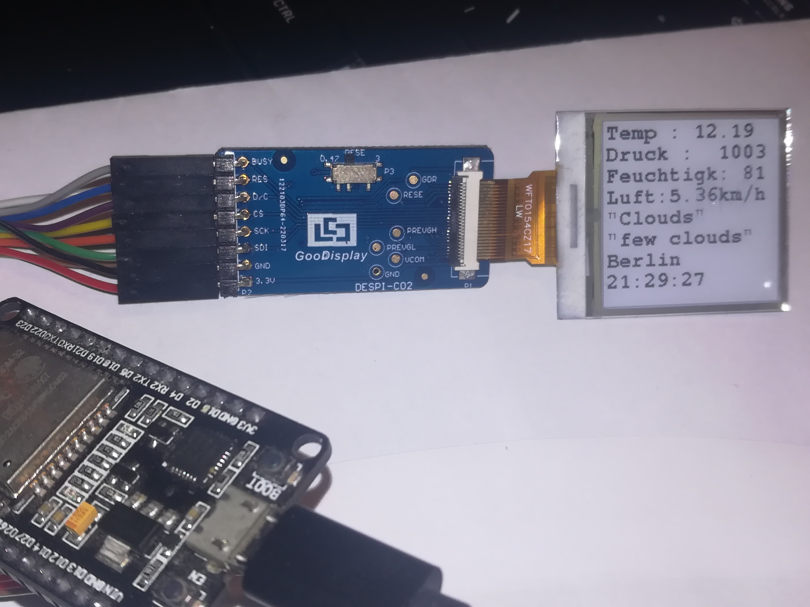
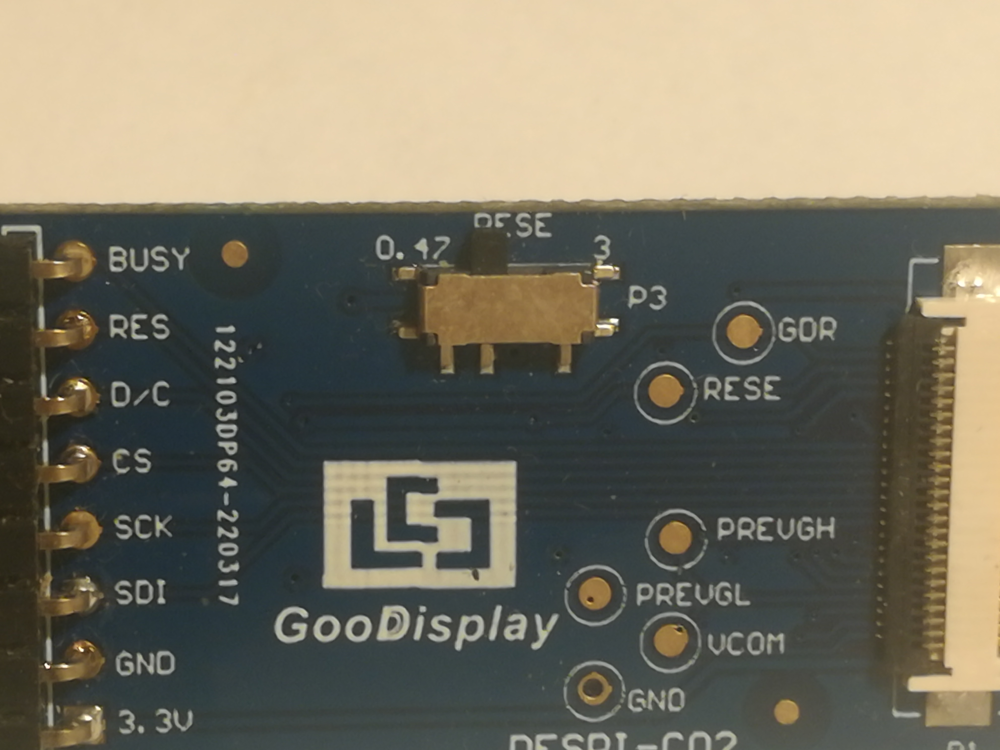
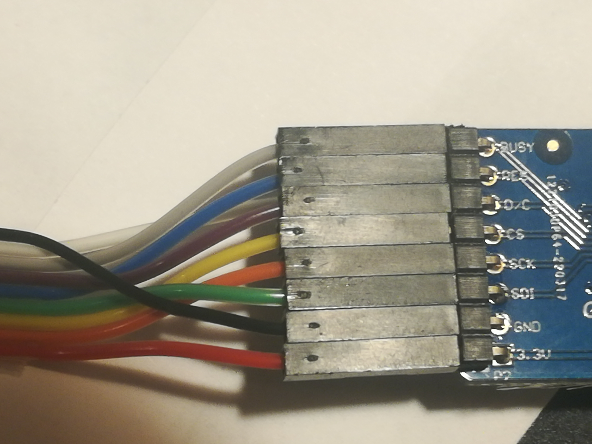
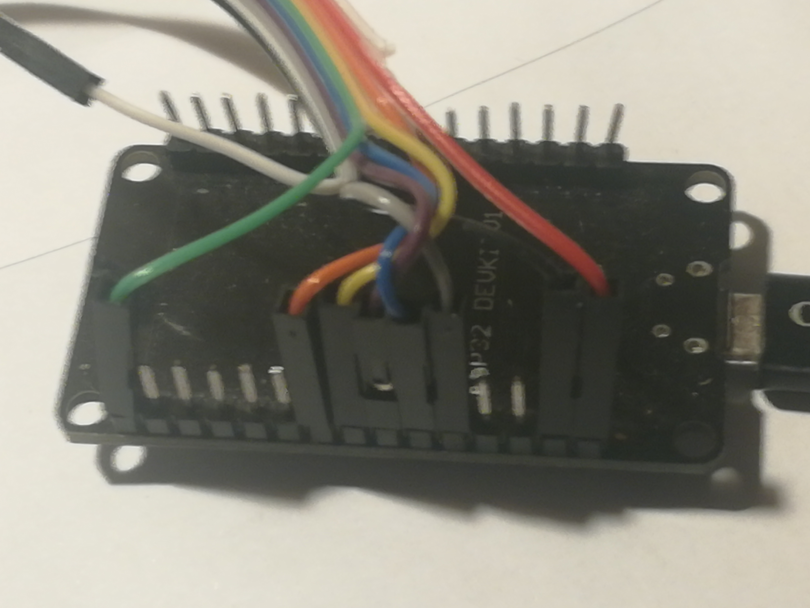

# weather_station_GxEPD2

## First of all get a token here :  
https://openweathermap.org   

modify the request if you are not in Berlin ( change DE too if you are not in germany )

## includes 
   
As libraries :
	zinggjm/GxEPD2@^1.4.9
	arduino-libraries/Arduino_JSON@^0.1.0

in declarations :
time  
sntp
WiFi  
HTTPClient  
Arduino_JSON  
WiFiClient  
WiFiClientSecure
###### TODO maybe too much wifi libs - check if I really use all of them

## hardware

ESP32 DOIT Devkit V1    
Goodisplay DESPI-CO2 display adapter with resistor button on position left. (see  the photos If this description is not clear enough)

photos :

## Pinout :

adapter - ESP32 DOIT Devkit V1  

Busy - 04  
RST - 16 [RX2]  
D/C - 17 [TX2]  
CS - 5 [SS]  
SCK - 18 [SCK]  
SDI - 23 [MOSI]  
GND - GND  
3.3 V - 3.3 V

I used the GxEPD2_DRIVER_CLASS GxEPD2_154_M10 // GDEW0154M10 152x152, UC8151D. change it if you own another screen.

# description
Setup :
* Connect to wifi (insert your credentials first)  
---
main loop :
-

* get a json from weather site and time from sntp (/or from dhcp server ? seems to not work but I got time another way. TODO check if I really need sntp)
* display stuff on screen  
1. temp
2. air pressure
3. moisture
4. air speed
5. main
6. description
7. city
8. time
----
end of setup
-
* wait 60000 ms ( 1 minute)
* refresh and restart the main loop